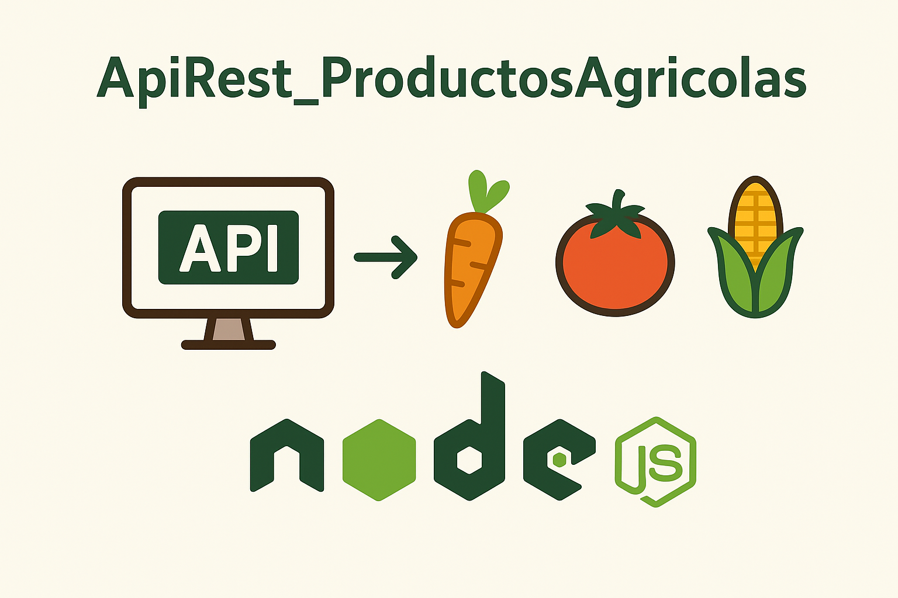

   

    
    
    
    
    
     
  
   

 

# ApiRest_ProductosAgricolas_NodeJs

* Api Rest acerca de Productos Agrícolas implementando NodeJs, Babel, Nodemon, Mongoose, Express, Git, MongoDB y Otras Tecnologías.
* Guía Base (Youtube) : https://www.youtube.com/watch?v=HEx2lVokPu0&ab_channel=Fazt
* Guía Base (Documentación Personal) : https://github.com/andresWeitzel/App_MicroFront_InvDes_NodeJs

 

* Repositorio dataset_productos_agricolas_mongodb : https://github.com/andresWeitzel/dataset_productos_agricolas_mongodb

